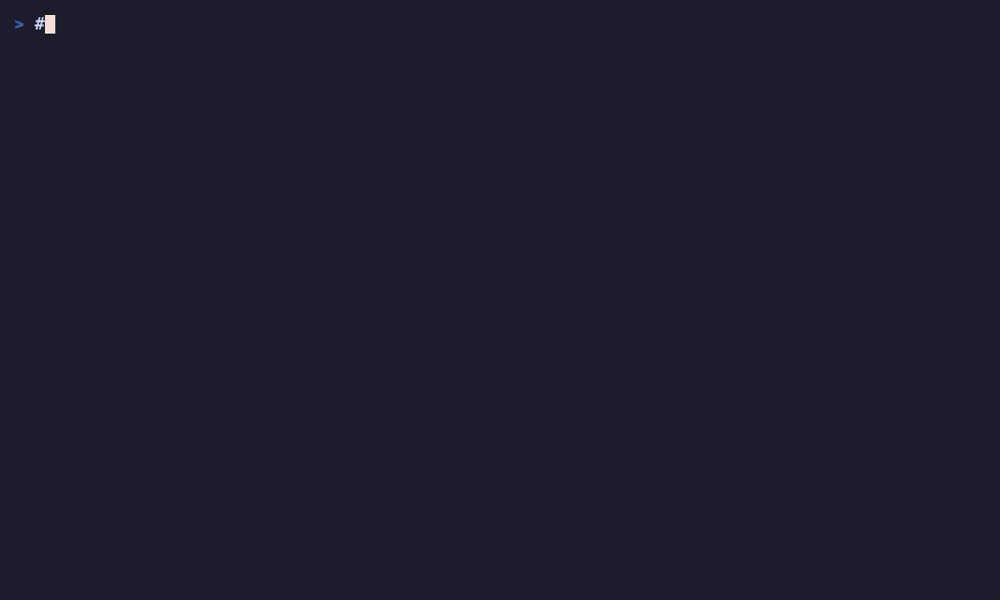

<div align="center">

# Claude Agent SDK UI

**Declarative Terminal UI Framework Built on React + Ink**

Beautiful, out-of-the-box CLI UI rendering for Claude Agent SDK



[](https://www.npmjs.com/package/claude-agent-sdk-ui)
[](https://www.typescriptlang.org/)
[](https://opensource.org/licenses/MIT)

[English](./README.md) | [中文](./README_CN.md)

</div>

---

## ✨ Key Features

- 🎨 **React + Ink Architecture** - Build terminal UI with declarative components
- 🚀 **Minimal API** - Full rendering in one line of code
- 🎭 **Component-Level Theme System** - Each theme controls complete layout and interaction, not just styling
- 🎁 **Rich Component Library** - Badge, Box, Divider, Table, Spinner, Markdown, and more
- 🌊 **Streaming Rendering** - Real-time updates with typing effect support
- 📼 **Log Replay** - Complete session logging and replay functionality
- 💪 **Type Safe** - Full TypeScript type definitions with compile-time guarantees
- ⚡ **High Performance** - Optimized rendering engine for handling large message volumes

---

## 📦 Installation

```bash
npm install claude-agent-sdk-ui @anthropic-ai/claude-agent-sdk
```

**Requirements:**
- Node.js >= 18.0.0
- @anthropic-ai/claude-agent-sdk >= 0.1.14

---

## 🚀 Quick Start

### Simplest Usage - One Line of Code

```typescript
import { query } from '@anthropic-ai/claude-agent-sdk';
import { renderQuery } from 'claude-agent-sdk-ui';

// 🎉 Super simple! One line does it all
await renderQuery(query({ prompt: 'Hello, Claude!' }));
```

### Streaming Rendering - With Typing Effect

```typescript
import { renderQueryStreaming } from 'claude-agent-sdk-ui';

// Streaming with typing effect
await renderQueryStreaming(
  query({
    prompt: 'Explain the benefits of TypeScript',
    options: { includePartialMessages: true }
  }),
  {
    streaming: true,
    typingEffect: true,
    typingSpeed: 20
  }
);
```

### Custom Configuration

```typescript
await renderQuery(
  query({
    prompt: 'Analyze the file structure of current directory',
    options: {
      maxTurns: 10,
      allowedTools: ['Read', 'Grep', 'Glob'],
    }
  }),
  {
    theme: 'claude-code',         // Theme selection
    showTimestamps: true,          // Show timestamps
    showSessionInfo: true,         // Show session info
    showFinalResult: true,         // Show final result
    showExecutionStats: false,     // Show execution stats
    showTokenUsage: false,         // Show token usage
    showThinking: true,            // Show thinking process
    showToolDetails: true,         // Show tool details
    maxOutputLines: 50,            // Max output lines
    logging: {                     // Logging config
      enabled: true,
      logPath: './logs'
    }
  }
);
```

### Using Renderer Class

```typescript
import { createRenderer } from 'claude-agent-sdk-ui';

// Create renderer instance
const renderer = createRenderer({
  theme: 'droid',
  showTokenUsage: true,
});

// Render messages
for await (const message of query({ prompt: '...' })) {
  await renderer.render(message);
}

// Cleanup resources
await renderer.cleanup();
```

---

## 📖 Core API

### Functional API

```typescript
// Render entire session
await renderQuery(queryGenerator, options?);

// Render entire session (streaming version)
await renderQueryStreaming(queryGenerator, options?);

// Render single message
await render(message, options?);
```

### Class-based API

```typescript
// Create standard renderer
const renderer = createRenderer(options?);

// Create streaming renderer
const streamingRenderer = createStreamingRenderer(options?);

// Render message
await renderer.render(message);

// Cleanup resources
await renderer.cleanup();
```

---

## 🎭 Theme System

### Component-Level Architecture

**v1.0.0** introduces a revolutionary theme system where each theme has **complete control over layout and components**, not just colors and symbols.

- 🏗️ Each theme contains its own complete component implementations
- 🎨 Themes can customize message layout, interaction patterns, and visual design
- 🔄 Dynamic component routing via proxy pattern
- 💪 Type-safe with compile-time guarantees

### Built-in Themes

#### Claude Code Theme
Clean, professional design inspired by Claude Code:
```typescript
const renderer = createRenderer({ theme: 'claude-code' });
```

#### Droid Theme
Modern CLI aesthetic with unique visual design:
- 🟠 Orange for "in progress" states (thinking, streaming, tool execution)
- 🔵 Cyan for completed content and stable UI elements
- ⛬ Hexagram symbol (⛬) for AI messages
- ↳ Arrow symbol (↳) for tool outputs
- Orange background labels for tool calls

```typescript
const renderer = createRenderer({ theme: 'droid' });
```

### Custom Themes

#### Simple Theme (Colors & Symbols Only)

```typescript
import { createTheme } from 'claude-agent-sdk-ui';

const myTheme = createTheme({
  name: 'my-theme',
  colors: {
    primary: '#FF6B6B',
    success: '#51CF66',
    error: '#FF6B6B',
    warning: '#FFD93D',
    info: '#4DABF7',
    text: '#F8F9FA',
    dim: '#868E96',
  },
  symbols: {
    success: '✅',
    error: '❌',
    warning: '⚠️',
    info: 'ℹ️',
    pending: '⏳',
    spinner: ['⠋', '⠙', '⠹', '⠸', '⠼', '⠴', '⠦', '⠧', '⠇', '⠏'],
  },
});

const renderer = createRenderer({ theme: myTheme });
```

#### Advanced Theme (Custom Layout)

For complete layout control, create custom component implementations:

```typescript
// themes/my-theme/config.ts
import { AssistantMessage } from './components/assistant-message';
import { StreamingAssistantMessage } from './components/streaming-assistant-message';
// ... import other components

export const myTheme: Theme = {
  name: 'my-theme',
  colors: { /* ... */ },
  symbols: { /* ... */ },
  components: {
    assistantMessage: AssistantMessage,
    streamingAssistantMessage: StreamingAssistantMessage,
    toolResultMessage: ToolResultMessage,
    systemMessage: SystemMessage,
    finalResult: FinalResult,
    appLayout: AppLayout,
  },
};
```

📚 **See the [Custom Layout Theme Guide](./docs/custom-layout-theme.md) for detailed instructions.**

---

## 🎁 UI Component Library

All components are built on React + Ink and can be used directly in your projects:

```typescript
import {
  Badge,
  Box,
  Divider,
  Spinner,
  StatusLine,
  Markdown,
  StreamingText,
  Table
} from 'claude-agent-sdk-ui';

// Badge - Status labels
<Badge type="success">SUCCESS</Badge>
<Badge type="error">ERROR</Badge>
<Badge type="info">INFO</Badge>

// Box - Bordered container
<Box borderStyle="round" padding={1}>
  Content here
</Box>

// Divider - Visual separator
<Divider style="heavy" text="SECTION TITLE" />

// Spinner - Loading animation
<Spinner type="dots" text="Loading..." />

// StatusLine - Status line
<StatusLine
  status="success"
  label="Read"
  message="File loaded"
  duration={500}
/>

// Markdown - Markdown rendering
<Markdown>{markdownContent}</Markdown>

// StreamingText - Streaming text
<StreamingText
  text="Hello, world!"
  speed={20}
  onComplete={() => {}}
/>

// Table - Data table
<Table
  headers={['Name', 'Value']}
  rows={[
    ['Foo', 'Bar'],
    ['Baz', 'Qux']
  ]}
/>
```

---

## 📼 Logging & Replay

### Enable Logging

```typescript
await renderQuery(
  query({ prompt: '...' }),
  {
    logging: {
      enabled: true,
      logPath: './logs',
      fileNameFormat: 'session-{sessionId}-{timestamp}.jsonl',
      verbose: true
    }
  }
);
```

Logs are saved in JSONL format (one JSON object per line) with complete message data and timestamps.

### Replay Logs

Use the CLI tool to replay previous sessions:

```bash
# Basic usage
npm run replay -- logs/session-xxx.jsonl

# Use custom theme
npm run replay -- logs/session-xxx.jsonl --theme droid

# Realtime mode, 2x speed
npm run replay -- logs/session-xxx.jsonl --realtime --speed 2

# Streaming rendering with thinking
npm run replay -- logs/session-xxx.jsonl --streaming --show-thinking

# Fixed delay mode, 500ms between messages
npm run replay -- logs/session-xxx.jsonl --fixed-delay 500

# Output summary after replay
npm run replay -- logs/session-xxx.jsonl --summary

# Output summary in JSON
npm run replay -- logs/session-xxx.jsonl --summary-json
```

Use in code:

```typescript
import { replayLog } from 'claude-agent-sdk-ui';

await replayLog('logs/session-xxx.jsonl', {
  theme: 'droid',
  realtime: true,
  speed: 2,
  showThinking: true,
  showToolDetails: true,
  summary: true
});
```

### Replay Statistics & Summary

The replay system now includes comprehensive statistics tracking:

**Summary Output** includes:
- 📊 Session duration and message counts
- 🔧 Tool execution statistics (success/failure rates)
- 💬 Token usage breakdown (input/output/cache)
- ⏱️ Performance metrics and timing
- 📈 Execution flow analysis

**Example Summary**:
```bash
npm run replay -- logs/session-xxx.jsonl --summary
```

Output:
```
Session Summary
===============
Duration: 45.2s
Messages: 28 total (12 assistant, 8 tool results, 8 system)
Tokens: 15,234 total (8,421 input, 6,813 output)

Tool Executions
===============
Read: 5 calls (100% success, avg 234ms)
Grep: 3 calls (100% success, avg 189ms)
Bash: 2 calls (100% success, avg 1.2s)
```

**JSON Output** for programmatic analysis:
```bash
npm run replay -- logs/session-xxx.jsonl --summary-json > stats.json
```

### Log Statistics API

Calculate statistics from log files programmatically:

```typescript
import { calculateLogStats } from 'claude-agent-sdk-ui';

const stats = await calculateLogStats('logs/session-xxx.jsonl');

console.log('Session duration:', stats.duration);
console.log('Total messages:', stats.totalMessages);
console.log('Token usage:', stats.tokenUsage);
console.log('Tool stats:', stats.toolStats);
```

---

## ⚙️ Configuration Options

### RendererOptions

```typescript
interface RendererOptions {
  // Theme configuration
  theme?: 'claude-code' | 'droid' | Theme;

  // Display options
  showTimestamps?: boolean;          // Show timestamps (default: false)
  showSessionInfo?: boolean;         // Show session info (default: true)
  showFinalResult?: boolean;         // Show final result (default: false)
  showExecutionStats?: boolean;      // Show execution stats (default: false)
  showTokenUsage?: boolean;          // Show token usage (default: false)
  showThinking?: boolean;            // Show thinking process (default: false)
  showToolDetails?: boolean;         // Show tool details (default: true)
  showToolContent?: boolean;         // Show content field in tool params (default: false)

  // Format options
  compact?: boolean;                 // Compact mode (default: false)
  maxOutputLines?: number;           // Max output lines (default: 100)
  maxWidth?: number;                 // Max width (default: 120)
  codeHighlight?: boolean;           // Code highlighting (default: true)

  // Streaming options
  streaming?: boolean;               // Enable streaming (default: false)
  typingEffect?: boolean;            // Typing effect (default: false)
  typingSpeed?: number;              // Typing speed (default: 20ms)

  // Logging options
  logging?: {
    enabled: boolean;                // Enable logging
    logPath?: string;                // Log directory (default: './logs')
    fileNameFormat?: string;         // Filename format
    verbose?: boolean;               // Verbose output
  };
}
```

---

## 📚 Examples

The project includes multiple examples demonstrating different use cases:

```bash
# Simple demo (standard rendering)
npm run demo

# Streaming demo (real-time streaming with typing effect)
npm run demo:streaming

# Theme preview (interactive theme switcher)
npm run demo:themes
```

Example files:
- `examples/agent-integration/hello-demo.ts` - Simplest standard rendering example
- `examples/agent-integration/hello-streaming-demo.ts` - Simple streaming rendering with real-time updates
- `examples/agent-integration/sample-demo.ts` - Complete streaming demo with logging and thinking display
- `examples/agent-integration/original-demo.ts` - Raw Claude Agent SDK usage (for comparison)
- `examples/theme-preview.tsx` - Interactive theme preview with toggles
- `examples/theme-templates/minimal-theme.ts` - Minimal theme template (colors & symbols only)
- `examples/theme-templates/card-theme.tsx` - Card-style layout template

---

## 🎨 Theme Preview Tool

The theme preview tool provides an interactive way to explore and test themes before integration:

```bash
npm run demo:themes
```

**Features**:
- 🔄 Switch between themes in real-time (press `t`)
- 👁️ Toggle display options on the fly:
  - `1` - Toggle timestamps
  - `2` - Toggle thinking blocks
  - `3` - Toggle tool details
  - `4` - Toggle token usage
- 📋 See all options and their effects instantly
- 🎯 Perfect for designing custom themes

**Use Cases**:
- Preview how your custom theme looks
- Compare built-in themes side by side
- Test theme configurations before deployment
- Demonstrate theme capabilities to stakeholders

---

## ⌨️ Command Mode

Command mode provides keyboard shortcuts and interactive commands during rendering:

### Using Command Overlay

```typescript
import { CommandOverlay } from 'claude-agent-sdk-ui';

// Display command palette
<CommandOverlay visible={showCommands} onClose={() => setShowCommands(false)} />
```

### Available Commands

| Key | Command | Description |
|-----|---------|-------------|
| `?` | Help | Show command palette |
| `q` | Quit | Exit application |
| `t` | Theme | Switch theme |
| `p` | Pause | Pause streaming |
| `r` | Resume | Resume streaming |
| `c` | Clear | Clear screen |

### Command Mode Hook

```typescript
import { useCommandMode } from 'claude-agent-sdk-ui';

function MyComponent() {
  const {
    currentCommand,
    isCommandMode,
    handleKeyPress,
    registerCommand
  } = useCommandMode();

  // Register custom command
  registerCommand('s', () => {
    console.log('Save triggered');
  });

  return (
    <Box onKeyPress={handleKeyPress}>
      {isCommandMode && <Text>Command mode active</Text>}
    </Box>
  );
}
```

---

## 📊 Statistics & Performance Tracking

### Real-time Statistics

Track statistics during streaming:

```typescript
import { StatsTracker } from 'claude-agent-sdk-ui';

const tracker = new StatsTracker();

for await (const message of query({ prompt: '...' })) {
  tracker.trackMessage(message);

  // Get current stats
  const stats = tracker.getStats();
  console.log('Tokens used:', stats.totalTokens);
  console.log('Tools called:', stats.toolCallCount);
}

// Final statistics
const finalStats = tracker.getFinalStats();
```

### Statistics Output

Statistics include:
- **Message Metrics**: Total count, by type breakdown
- **Token Usage**: Input tokens, output tokens, cache hits
- **Tool Execution**: Calls per tool, success rates, timing
- **Performance**: Average response time, total duration
- **Error Tracking**: Failure count, error types

Example output:
```typescript
{
  totalMessages: 28,
  messagesByType: {
    assistant: 12,
    toolResult: 8,
    system: 8
  },
  tokenUsage: {
    input: 8421,
    output: 6813,
    cacheHit: 2145
  },
  toolStats: {
    Read: { calls: 5, success: 5, avgTime: 234 },
    Grep: { calls: 3, success: 3, avgTime: 189 }
  }
}
```

---

## 🛠️ Development

### Setup

```bash
# Install dependencies
npm install

# Development mode (watch files)
npm run dev

# Build
npm run build

# Type check
npm run typecheck

# Lint
npm run lint

# Format
npm run format
```

### Testing

```bash
# Run tests
npm test

# Run test UI
npm run test:ui

# Run table test
npm run test:table
```

---

## 🏗️ Architecture

### Core Architecture

```
┌─────────────────────────────────────────────┐
│       React + Ink Component Layer           │
│  (SystemMessage, AssistantMessage, etc.)    │
└─────────────────────────────────────────────┘
                    ↓
┌─────────────────────────────────────────────┐
│         Renderer Layer                       │
│  (UIRenderer, StreamingRenderer)            │
└─────────────────────────────────────────────┘
                    ↓
┌─────────────────────────────────────────────┐
│      Message Router Layer                    │
│  (Routes messages to components)            │
└─────────────────────────────────────────────┘
                    ↓
┌─────────────────────────────────────────────┐
│         UI Component Library                 │
│  (Badge, Box, Divider, Table, etc.)         │
└─────────────────────────────────────────────┘
                    ↓
┌─────────────────────────────────────────────┐
│         Utility Layer                        │
│  (String, Time, Terminal utils)             │
└─────────────────────────────────────────────┘
```

### Key Characteristics

1. **Declarative Components**: Build terminal UI using React components
2. **Component Reusability**: All UI components can be used independently
3. **Theme System**: Full theme customization capability
4. **Type Safety**: Complete TypeScript type definitions
5. **Extensibility**: Easy to add new message types and components

---

## 🎯 Supported Message Types

- ✅ **System Messages** - Session initialization, compression boundaries
- ✅ **Assistant Messages** - Text, thinking, tool usage
- ✅ **User Messages** - Tool results
- ✅ **Result Messages** - Success, errors
- ✅ **Partial Messages** - Streaming output

---

## 🤝 Contributing

Contributions are welcome! Check out:

- 🐛 [Issue Tracker](https://github.com/yangyang0507/claude-agent-sdk-ui/issues)
- 💡 [Feature Requests](https://github.com/yangyang0507/claude-agent-sdk-ui/issues/new)

### Contributing Steps

1. Fork this repository
2. Create a feature branch (`git checkout -b feature/amazing-feature`)
3. Commit your changes (`git commit -m 'Add amazing feature'`)
4. Push to the branch (`git push origin feature/amazing-feature`)
5. Open a Pull Request

---

## 📄 License

MIT License © 2025

---

## 🔗 Links

- 📚 [Claude Agent SDK - TypeScript](https://docs.anthropic.com/en/api/agent-sdk/typescript)
- 📘 [Claude Agent SDK - Python](https://docs.anthropic.com/en/api/agent-sdk/python)
- 🌐 [Claude API Documentation](https://docs.anthropic.com/)
- 💬 [GitHub Issues](https://github.com/yangyang0507/claude-agent-sdk-ui/issues)
- 📦 [npm Package](https://www.npmjs.com/package/claude-agent-sdk-ui)

---

<div align="center">

**Empower every developer to build beautiful, professional AI Agent CLI applications!** 🚀

Made with ❤️ for the Claude Agent SDK Community

[⭐ Star us](https://github.com/yangyang0507/claude-agent-sdk-ui) | [🐛 Report Issues](https://github.com/yangyang0507/claude-agent-sdk-ui/issues)

</div>
